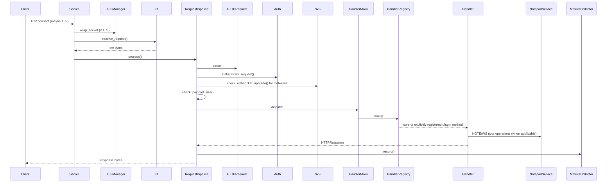

# Architecture

## Module layout

```
exphttp/
  __main__.py          # python -m exphttp entry point
  cli.py               # public console-script wrapper
  server.py            # public server exports

src/
  __main__.py          # compatibility module entry point
  cli.py               # argparse
  server.py            # ExperimentalHTTPServer: socket lifecycle + WS helpers
  settings.py          # INI/env/CLI settings normalization and validation
  extensions.py        # explicit plugin API dataclasses and plugin loading
  metrics.py           # MetricsCollector (thread-safe counters)
  notepad_service.py   # NOTE domain logic shared by HTTP and WebSocket
  request_pipeline.py  # auth/dispatch/send orchestration
  config.py            # constants: hidden files, status map
  websocket.py         # RFC 6455 frame parser and handshake
  http/
    request.py         # HTTPRequest parser
    response.py        # HTTPResponse builder
    io.py              # socket reader with Content-Length enforcement
    utils.py           # path helpers + shared descendant resolver
  handlers/
    base.py            # BaseHandler (shared utilities)
    registry.py        # HandlerRegistry (method -> callable)
    files.py           # GET/POST/PUT/DELETE/FETCH/NONE
    info.py            # INFO, PING
    notepad.py         # NOTE HTTP handlers
    advanced_upload.py # advanced upload transports
    smuggle.py         # SMUGGLE (HTML smuggling demo)
  security/
    auth.py            # Basic Auth + rate limiter
    crypto.py          # XOR/HMAC helpers
    keys.py            # ECDH P-256 for Secure Notepad
    tls.py             # cert generation helpers + built-in ACME/sslip.io integration
    tls_manager.py     # TLSManager: SSL context lifecycle + temp files
  utils/
    captcha.py         # PIL-free CAPTCHA renderer
    smuggling.py       # HTML smuggling template
```

## Request flow



## Concurrency

See [ADR-005](ADR/ADR-005-threadpool-over-asyncio.md). One accept loop,
`ThreadPoolExecutor` pool (10 workers by default), keep-alive per worker.

## Runtime persistence

Runtime file state is split across a small number of explicit directories:

- `--dir` / `root_dir` is the operator-owned content root. The server creates
  `uploads/` for user-visible file operations and `notes/` for Secure Notepad
  ciphertext and plaintext note metadata.
- Temporary self-signed TLS certificates are created under the platform temp
  directory and removed on process exit.
- ACME state is stored under `Path.home() / ".exphttp" / "acme"`, including
  account keys, domain private keys, and `live/<domain>/fullchain.pem` plus
  `privkey.pem`. `TLSManager` also reads the legacy
  `Path.home() / ".exphttp" / "letsencrypt"` cache when the new ACME cache is
  empty.
- In the Docker image the runtime user is `exphttp`, so ACME state lives under
  `/home/exphttp/.exphttp`. The ACME Compose profile mounts that path as a
  dedicated named volume; treat it as certificate secret material.

## Security layers

1. **Transport** — TLS 1.2+ via `TLSManager`.
2. **Authentication** — Basic Auth with PBKDF2-SHA256
   (`BasicAuthenticator`), rate-limited (`AuthRateLimiter`).
3. **Authorisation** — path containment via
   `src.http.utils.resolve_descendant_path()` under
   `BaseHandler._get_file_path()` / `_resolve_safe_path()`, plus
   `HIDDEN_FILES` checks in handler policy.
4. **Upload scope** — all user-visible file reads and writes are constrained
   to `<root>/uploads/`; the built-in UI and `/static/...` are served
   read-only package resources.
5. **Advanced upload** — unknown non-standard methods carrying upload payload
   data route to `AdvancedUploadHandlersMixin`, which supports JSON body,
   header, chunked-header, and URL transports.

See the [threat model](threat-model.md) for what each layer buys you.

## Configuration and extension boundaries

`src.settings.ServerSettings` is the operator-facing configuration boundary.
It resolves built-in defaults, INI files, `EXPHTTP_*` environment variables,
and explicit CLI flags before the CLI constructs `ExperimentalHTTPServer`.
The `public_direct` preset is validated in this layer so services and
containers can run `exphttp --config <file> --check-config` before startup.

`src.extensions` / `exphttp.extensions` is the only supported external plugin
surface. Plugins are not auto-discovered; an operator must explicitly list
modules in configuration or pass `PluginSpec` objects when embedding the
server. Plugin methods are registered after core profile methods, cannot
override core methods by default, and carry policy metadata for profile
gating, CORS, and browser mutation checks.
