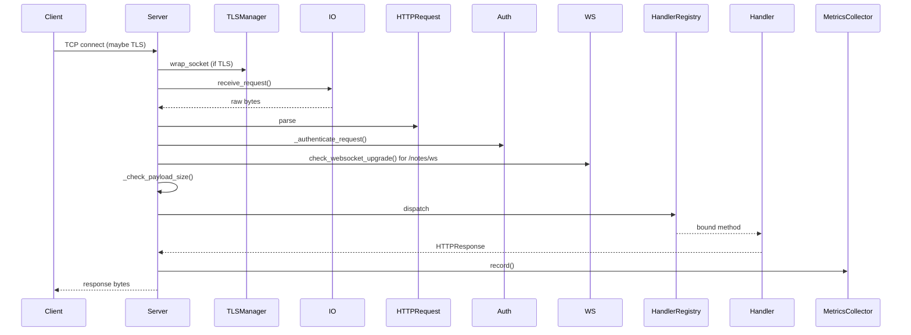

# Architecture

## Module layout

```
src/
  __main__.py          # python -m src entry point
  cli.py               # argparse
  server.py            # ExperimentalHTTPServer: socket + dispatch
  metrics.py           # MetricsCollector (thread-safe counters)
  config.py            # constants: hidden files, OPSEC prefixes, status map
  websocket.py         # RFC 6455 frame parser and handshake
  http/
    request.py         # HTTPRequest parser
    response.py        # HTTPResponse builder
    io.py              # socket reader with Content-Length enforcement
    utils.py           # path helpers
  handlers/
    base.py            # BaseHandler (shared utilities)
    registry.py        # HandlerRegistry (method -> callable)
    files.py           # GET/POST/PUT/DELETE/FETCH/NONE
    info.py            # INFO, PING
    notepad.py         # NOTE + WebSocket realtime
    opsec.py           # randomised upload method
    smuggle.py         # SMUGGLE (HTML smuggling demo)
  security/
    auth.py            # Basic Auth + rate limiter
    crypto.py          # XOR/HMAC/AES-GCM OPSEC payload
    keys.py            # ECDH P-256 for Secure Notepad
    tls.py             # cert generation, Let's Encrypt
    tls_manager.py     # TLSManager: SSL context lifecycle
  utils/
    captcha.py         # PIL-free CAPTCHA renderer
    smuggling.py       # HTML smuggling template
```

## Request flow



## Concurrency

See [ADR-005](ADR/ADR-005-threadpool-over-asyncio.md). One accept loop,
`ThreadPoolExecutor` pool (10 workers by default), keep-alive per worker.

## Security layers

1. **Transport** — TLS 1.2+ via `TLSManager`.
2. **Authentication** — Basic Auth with SHA-256 + salt
   (`BasicAuthenticator`), rate-limited (`AuthRateLimiter`).
3. **Authorisation** — sandbox mode in `BaseHandler._safe_join`,
   `HIDDEN_FILES` frozenset in `config.py`.
4. **Obfuscation** — OPSEC mode (random method names, nginx header spoof,
   XOR+HMAC or AES-GCM payload encryption).

See the [threat model](threat-model.md) for what each layer buys you.
